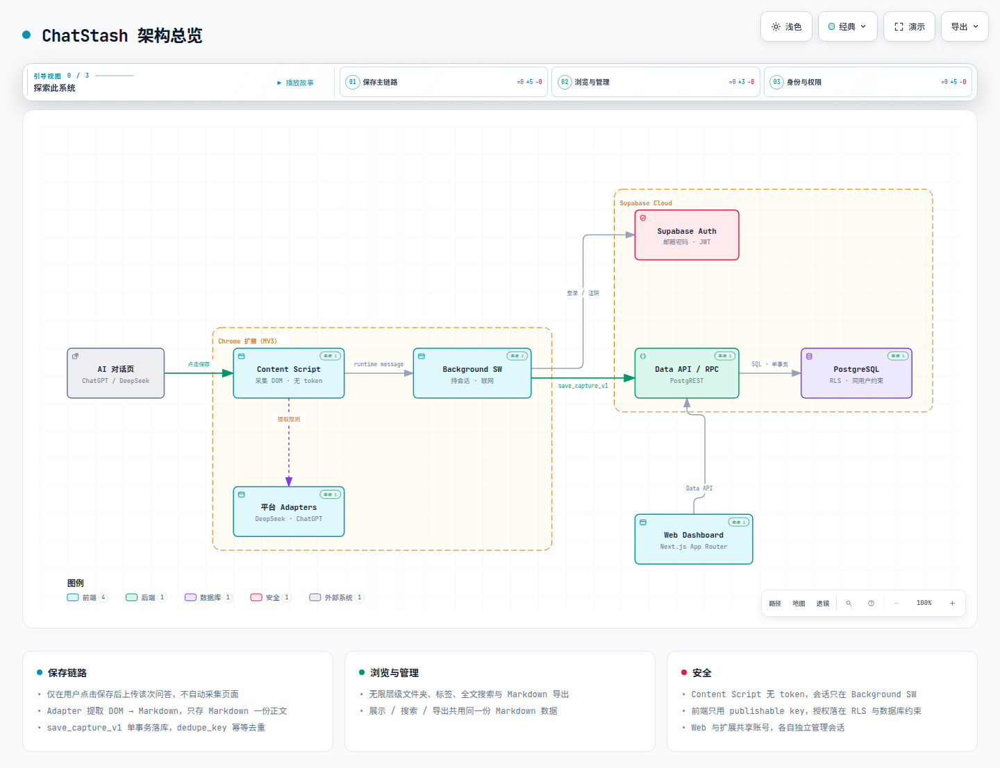

# ChatStash（快存）

面向 AI 重度用户的跨平台 AI 对话收藏与知识管理工具。在 ChatGPT、DeepSeek 等对话页一键保存问答至云端，并在 Web 端统一整理、搜索与导出。

## 特性

- **一键收藏**：Chrome 扩展（MV3）在 AI 回复旁注入保存按钮，自动提取并转为标准 Markdown。
- **多平台适配**：已支持 DeepSeek、ChatGPT，采用 Adapter 架构解耦，极易扩展新平台。
- **统一知识库**：Web Dashboard 支持无限层级文件夹、标签分类、全文搜索与 Markdown 导出。
- **安全私密**：基于 Supabase RLS 行级隔离，前端仅使用公开密钥，按需采集、单事务幂等保存。

## 架构

[](docs/chatstash-architecture.html)

> 点击图片可查看[交互式架构图](docs/chatstash-architecture.html)。

```text
AI 对话页 ──(Content Script)──> Background SW ──> Supabase (Auth / RPC / RLS)
                                                        │
Next.js Dashboard ──────────────────────────────────────┘
```

## 目录结构

```text
apps/
  extension/     # Chrome 扩展（Plasmo · MV3 · React · TS）
  web/           # Web Dashboard（Next.js App Router · Tailwind）
packages/
  adapters/      # 平台 DOM 解析与 Markdown 转换
  shared/        # 数据契约、协议与类型定义
supabase/        # Migrations、Seed 与 RPC 函数
docs/            # 项目文档与发布规范
```

## 快速开始

**环境要求**：Node.js >= 20.19、pnpm、Supabase CLI、Docker。

```bash
# 1. 安装依赖并启动本地数据库（自动应用 migrations + seed）
pnpm install
pnpm db:reset

# 2. 配置环境变量
cp apps/web/.env.example apps/web/.env.local
cp apps/extension/.env.example apps/extension/.env.local

# 3. 启动开发服务（并行启动 extension 与 web）
pnpm dev
```

> **加载扩展**：在 Chrome 打开 `chrome://extensions/`，开启开发者模式，点击「加载已解压的扩展程序」，选择 `apps/extension/build/chrome-mv3-dev` 目录。

## 常用命令

| 命令 | 说明 |
| --- | --- |
| `pnpm dev` | 并行启动 Web 与 Extension 开发服务 |
| `pnpm build` | 全量打包构建 |
| `pnpm test` / `lint` / `typecheck` | 运行测试 / 代码检查 / 类型检查 |
| `pnpm db:reset` / `db:types` | 重置本地数据库 / 生成 TypeScript 类型 |

## 文档

- [MVP 规格与任务基线](openspec/changes/establish-chatstash-mvp/)
- [验收测试指南](docs/manual-acceptance-guide.md)
- [发布核对清单](docs/release-checklist.md)
- [产品愿景与架构规范](docs/ai-development-spec.md)
